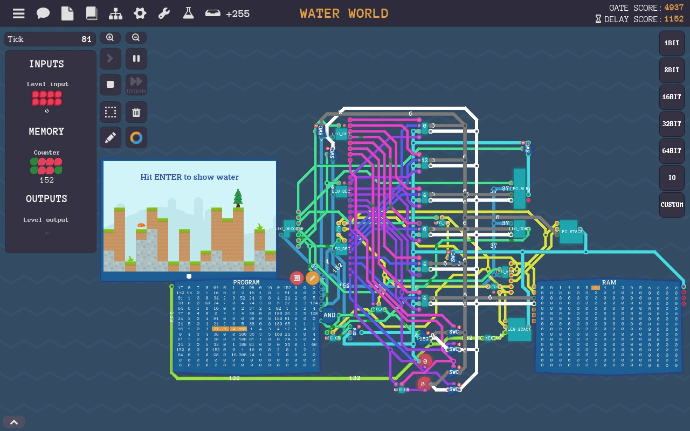

# TuringSim: A CPU simulator for the game Turing Complete
This simulator supports the ISA designed by me in the game
[Turing Complete](https://store.steampowered.com/app/1444480/Turing_Complete/).

You can use ```label label_name``` and ```const const_name const_value``` 
Just as in the game, simplify register assignment and jump target definition.

Turing Complete uses 4-byte fixed-length instructions so that you may use ```_``` as a placeholder.

### a fib example:
```
const start 1
movi start _ r0
movi start _ r1
mov in _ r4
label loop
mov r0 _ out
add r0 r1 r2
mov r1 _ r0
mov r2 _ r1
addi r3 1 r3
jl r3 r4 loop
exit
```
### output is as below:
```
Hello world!
Output: 1
Output: 1
Output: 2
Output: 3
Output: 5
Output: 8
Output: 13
Output: 21
Output: 34
Output: 55
Program exited.
```
### game screenshot (final level)：

